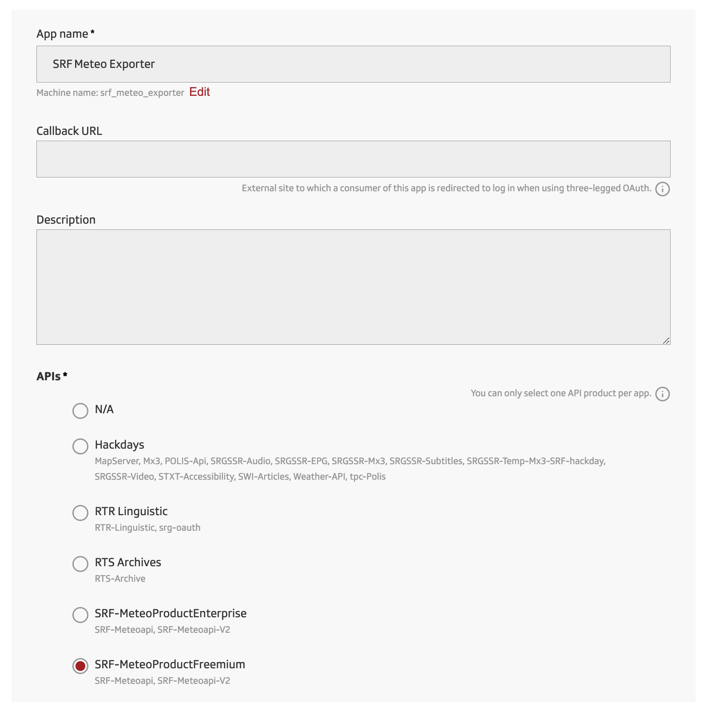

# SRF Meteo Exporter

Prometheus Metrics exporter for the weather and forecast data provided by the [SRF Meteo API](https://developer.srgssr.ch/api-catalog/srf-weather). It exposes the weather data for the current hour, for the next 3 hours and for the current day.


## Usage
It's easiest to run the exporter using Docker Compose:

```yml
srf-meteo-exporter:
  hostname: srf-meteo-exporter
  image: ghcr.io/simonalbrecht/srf-meteo-exporter:latest
  restart: unless-stopped
  ports:
    - "3000:3000"
  environment:
    - LOCATION_ZIP=$SRF_METEO_LOCATION_ZIP
    - CONSUMER_KEY=$SRF_METEO_CONSUMER_KEY
    - CONSUMER_SECRET=$SRF_METEO_CONSUMER_SECRET
```
Where `$SRF_METEO_LOCATION_ZIP` is your Swiss Postal/ZIP Code for which to get the weather data, such as `8050` for Zurich.

The values for `$SRF_METEO_CONSUMER_KEY` and `$SRF_METEO_CONSUMER_SECRET` can be obtained by signing up on the SRG-SSR Developer Portal and registering a new Application with the `SRF-MeteoProductFreemium` product selected:



Once started, visit [http://localhost:3000/metrics](http://localhost:3000/metrics) to see the metrics.

### Configuration
| Environment Variable | Description | Default | Required |
| -------------------- | ----------- | ------- | -------- |
| `CONSUMER_KEY` | The key of the OAuth Consumer from the Developer Portal's App | - | ✅ |
| `CONSUMER_SECRET` | The secret of the OAuth Consumer from the Developer Portal'App | - | ✅ |
| `LOCATION_ZIP` | The Postal/ZIP code for which to fetch the weather data | - | ✅ |
| `HOST` | To which hostname/IP to bind the server | `localhost` | ❌ |
| `PORT` | On which port the server should listen | `3000` | ❌ |
| `REQUEST_QUOTA_PER_DAY` | The number of requests available per day included in the API Plan | `50` | ❌ |
| `METEO_API_BASE_URL` | The base API URL to use for the API | `https://api.srgssr.ch/srf-meteo/v2` | ❌ |
| `OAUTH_ACCESS_TOKEN_URL` | The URL from which to obtain the OAuth access token. If it is an empty string, OAuth will be skipped. | `https://api.srgssr.ch/oauth/v1/accesstoken?grant_type=client_credentials` | ❌ |
| `OAUTH_ACCESS_TOKEN_REFRESH_INTERVAL` | The refresh interval of the OAuth access token in milliseconds | `601200000` | ❌ |
| `LOG_LEVEL` | The [pino](https://github.com/pinojs/pino) log level to use for logs | `info` | ❌ |
| DATA_PATH | Path to where to store the state and cache data | `./data` | ❌ |
| MOCKED | Use mocked data instead of fetching real requests | `false` | ❌ |

### Grafana Dashboard
A basic example Grafana dashboard is provided with [grafana/srf-meteo-exporter.json](grafana/srf-meteo-exporter.json).

## Development
### Setup
Before starting development, make sure you have the following installed:

* Node 21.x
* Yarn 1.x

Alternatively, use [volta](https://volta.sh/) to automatically install the required versions.

Now, run the following to download the dependencies and create the initial configuration:

```sh
yarn install
cp .env.example .env
```

### Development Mode
To run the development server with mock data as well as with auto-reload on code changes:

```sh
yarn dev
```

The server will start on [http://localhost:3000](http://localhost:3000).

To disable the use of mock data and instead use the real data from the API, change `NODE_ENV=development` on the `dev` script in `package.json` to `NODE_ENV=production`. ⚠️ This may cause you to run into the API rate-limits rather quickly! 

### Production Mode
To run the application in production mode, run the following:

```sh
yarn build
yarn start
```

This will start the server on [http://localhost:3000](http://localhost:3000).

### Linting
To lint the code, run:

```sh
yarn lint
```

To automatically fix the obvious/easy things, run:

```sh
yarn lint:fix
```

## Copyright
All Weather and Forecast Data is Copyright by SRG-SSR.

SRF Meteo Exporter is Copyright Simon Albrecht, licensed under the MIT License.